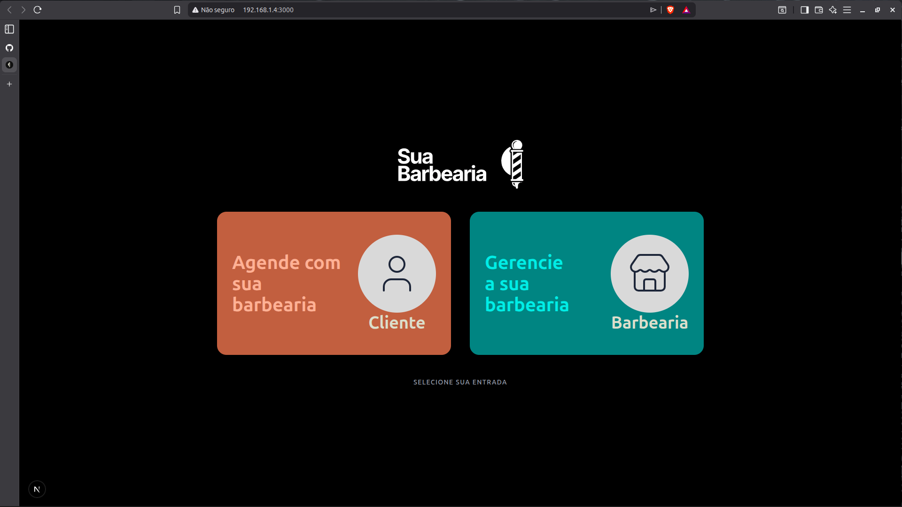
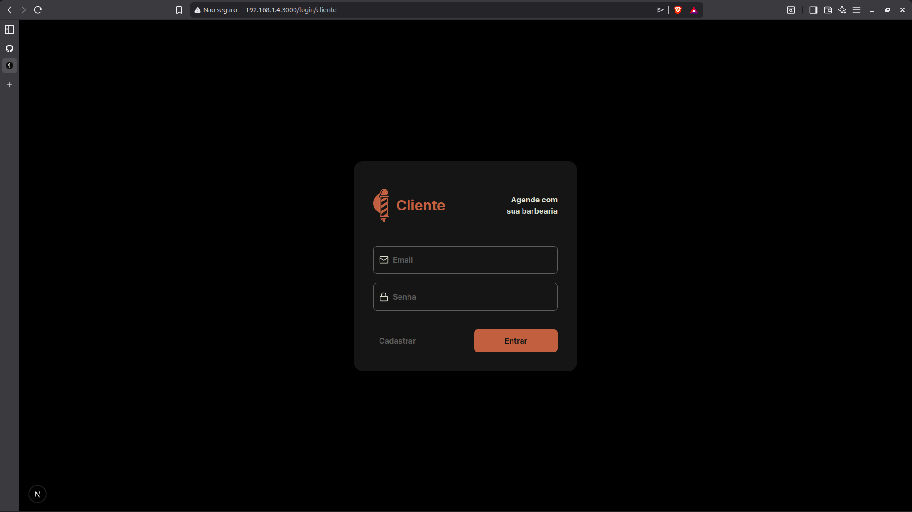
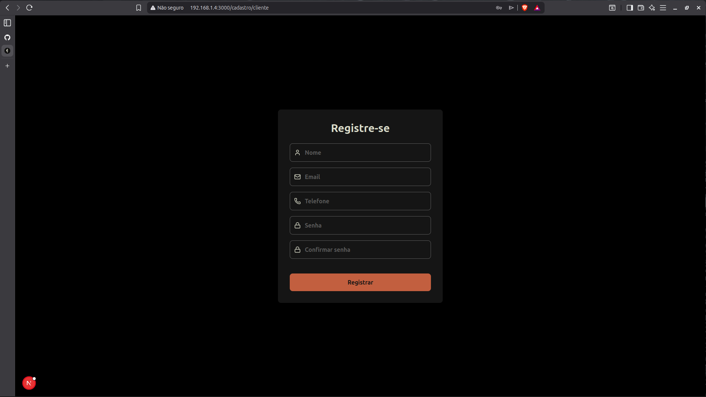
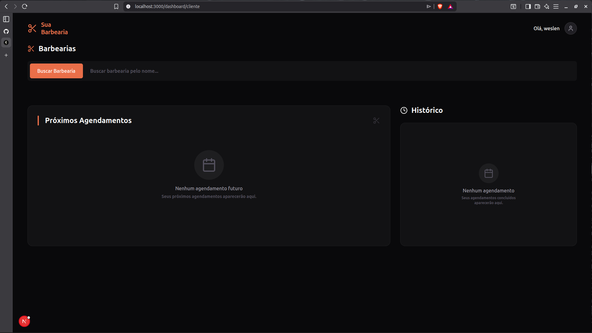
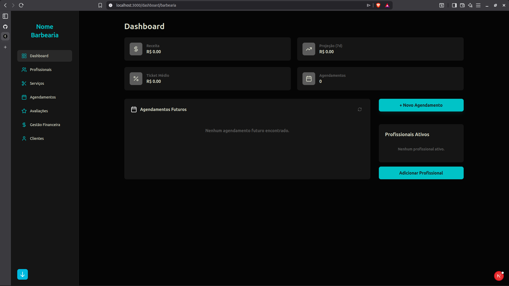

<!-- PROJECT_METADATA
{
  "title": "Sua Barbearia Frontend",
  "short_description": "Interface web moderna para o sistema de agendamento Sua Barbearia.",
  "primary_stack": ["Next.js", "React", "TypeScript", "Tailwind CSS"],
  "detail_description": "Frontend desenvolvido com Next.js (App Router) e TypeScript, oferecendo uma experiência fluida para agendamentos.",
  "images": ["IMG/print1.png", "IMG/print2.png", "IMG/print3.png", "IMG/print4.png", "IMG/print5.png"],
  "cover_image": "IMG/print1.png",
  "live_url": ""
}
-->
# Sua Barbearia Frontend

Frontend da plataforma Sua Barbearia, desenvolvido com Next.js e TypeScript.

## Tecnologias

- Next.js (App Router)
- React
- TypeScript
- Tailwind CSS

## Como rodar localmente

1. Instale as dependencias:

```bash
npm install
```

2. Inicie o servidor de desenvolvimento:

```bash
npm run dev
```

3. Acesse no navegador:

```text
http://localhost:3000
```

## Estrutura principal

- `app/`: rotas e layouts da aplicacao
- `components/`: componentes reutilizaveis
- `services/`: camada de comunicacao com API
- `types/`: tipos TypeScript
- `utils/`: funcoes auxiliares
- `assets/` e `public/`: arquivos estaticos

## Imagens do projeto

### Capturas de tela (IMG)

| Tela 1 | Tela 2 |
| --- | --- |
|  |  |

| Tela 3 | Tela 4 |
| --- | --- |
|  |  |

| Tela 5 |
| --- |
|  |
